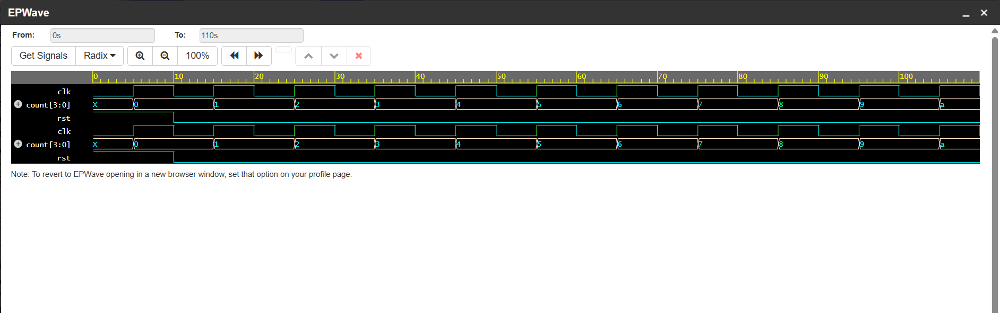

# 4-Bit Up Counter using SystemVerilog

## Overview
This project implements a 4-bit synchronous up counter using SystemVerilog.

## Features
- Sequential logic design
- Positive edge triggered counter
- Reset functionality
- Simulation verification

## Tools Used
- SystemVerilog
- Icarus Verilog
- EDA Playground
- EPWave

## Files
- `counter.sv` → Design module
- `counter_tb.sv` → Testbench

## Simulation Output

## Working
The counter increments on every positive edge of the clock signal.

## Counter Sequence
0000 → 0001 → 0010 → 0011 ...

## Applications
- Digital clocks
- Timers
- Embedded systems
- FPGA designs

## Author
Pavithra B
